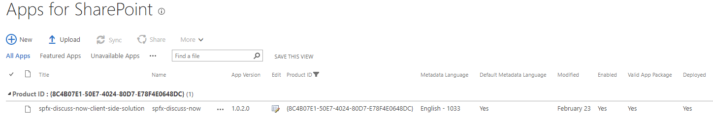
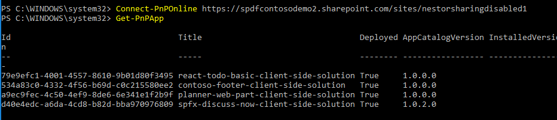

# Install SharePoint Framework solution

## Summary

The `installSolution` allows you to install a solution you have deployed to the tenant app catalog and enabled using the new ALM APIs.

> More details on ALM APIs are available from [official SharePoint Development documentation](https://docs.microsoft.com/en-us/sharepoint/dev/apis/alm-api-for-spfx-add-ins).

-  For this example you need to first upload the solution to the app catalog and enable it.

    

- You then need to reference this solution in your InstallSPFXSolution script action. To get the solution ID login to a site using Connect-PnPOnline cmdlet and then run Get-PnPApp. This will return a list of your deployed solutions. Find the one you wish to install via site script and grab that id.

    

- After you execute your script, you can confirm that the solution has been installed on the site by moving to site contents view and confirming it's existance.

    

- Any SharePoint Framework client-side web part or extension included in the just deployed solution would be now available in the site.

    

> Notice that this `installSPFXSolution` has been designed for solutions which require to be installed on the sites and are not tenant-deployed through tenant app catalog. 

## Sample

Solution|Author(s)
--------|---------
install-appcat-solution | SharePoint Team

## Version history

Version|Date|Comments
-------|----|--------
1.0|April 10, 2018|Initial release
1.1|July 16, 2018|Action name has been changed from installSPFXSolution to installSolution

## Disclaimer
**THIS CODE IS PROVIDED *AS IS* WITHOUT WARRANTY OF ANY KIND, EITHER EXPRESS OR IMPLIED, INCLUDING ANY IMPLIED WARRANTIES OF FITNESS FOR A PARTICULAR PURPOSE, MERCHANTABILITY, OR NON-INFRINGEMENT.**

---

