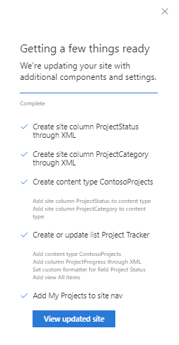
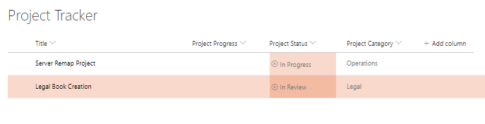

# Apply Custom Column and View formatting to a list

## Summary

In this example we illustrate how you can apply custom column and a view formatting to a list. Column formatting is being applied to the "Project Status" field, with conditional iconography and color being applied to the field based on the value. Similarly, row formatting has been applied to the default "All Items" view to format the row background (using the predefined 'sp-field-severity--blocked' class) if the list item is identified with the "Legal" project category.

For more details on the syntax check out: Use column formatting to customize SharePoint (https://docs.microsoft.com/en-us/sharepoint/dev/declarative-customization/column-formatting).

Here's how the list will look after script has been applied.

## Sample

Solution|Author(s)
--------|---------
site-apply-column-and-row-formatting | Sean Squires

## Version history

Version|Date|Comments
-------|----|--------
1.0| August 7, 2018 |Initial release

## Disclaimer
**THIS CODE IS PROVIDED *AS IS* WITHOUT WARRANTY OF ANY KIND, EITHER EXPRESS OR IMPLIED, INCLUDING ANY IMPLIED WARRANTIES OF FITNESS FOR A PARTICULAR PURPOSE, MERCHANTABILITY, OR NON-INFRINGEMENT.**

---

