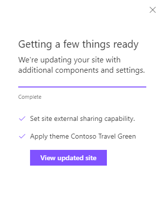

# Configure external sharing setting

## Summary

You can use the `setSiteExternalSharingCapability` action to configure the external sharing settings of the site.

For more details on this setting see: https://support.office.com/en-us/article/manage-external-sharing-for-your-sharepoint-online-environment-c8a462eb-0723-4b0b-8d0a-70feafe4be85

This sample illustrates using the setSiteExternalSharingCapability action to restrict sharing of content to only external users who are already in your Office 365 user directory. For example, users who have previously accepted a sharing invitation or users who you have imported from another Office 365 or Azure Active Directory tenant.

There are four options for this settings action:

1. Disabled
2. ExistingExternalUserSharingOnly
3. ExternalUserSharingOnly
4. ExternalUserAndGuestSharing

> Note that if a value is not specified, we do not overwrite the value already specified in the tenant.

## Sample

Solution|Author(s)
--------|---------
apply-external-sharing-capability.json | SharePoint Team

## Version history

Version|Date|Comments
-------|----|--------
1.0|April 10, 2018|Initial release

## Disclaimer
**THIS CODE IS PROVIDED *AS IS* WITHOUT WARRANTY OF ANY KIND, EITHER EXPRESS OR IMPLIED, INCLUDING ANY IMPLIED WARRANTIES OF FITNESS FOR A PARTICULAR PURPOSE, MERCHANTABILITY, OR NON-INFRINGEMENT.**

---

