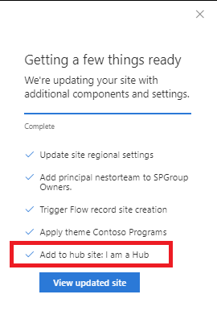

# Joining site to a hub site

## Summary

This sample illustrates using a joinHubSite script action to automatically join a site to an existing hub site. This script action supports two parameters - the hub site ID (required) and the hub site name (optional).

To learn more about hub sites: https://support.office.com/en-us/article/planning-your-sharepoint-hub-sites-4e95dcd8-7e79-4732-aa9b-2f351031b4c2?ui=en-US&rs=en-US&ad=US

To get the hub site ID you can view its source page or use the PowerShell command: `Get-SPOHubSite -Identity <site-url>`

## Sample

Solution|Author(s)
--------|---------
site-apply-join-hubsite | Sean Squires

## Version history

Version|Date|Comments
-------|----|--------
1.0| August 7, 2018 |Initial release

## Disclaimer
**THIS CODE IS PROVIDED *AS IS* WITHOUT WARRANTY OF ANY KIND, EITHER EXPRESS OR IMPLIED, INCLUDING ANY IMPLIED WARRANTIES OF FITNESS FOR A PARTICULAR PURPOSE, MERCHANTABILITY, OR NON-INFRINGEMENT.**

---

