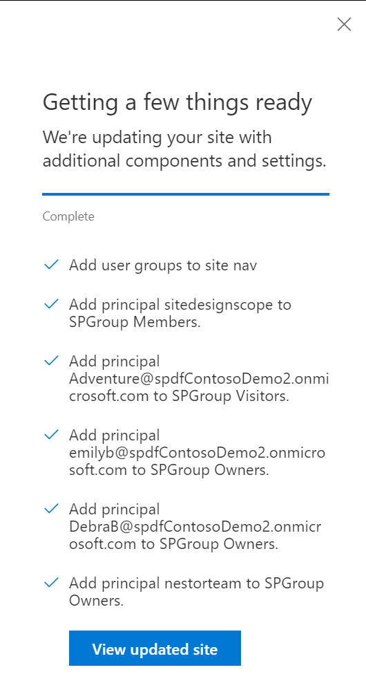

# Adding other users and groups to the site SharePoint groups

## Summary

You can use the addPrincipaltoSPGroup action to add other users and groups to the site SharePoint groups. Note: not O365 Groups.

Use the addPrincipalToGroup action to manage the addition of users and groups to select default SharePoint groups. For more information, see "Understanding SharePoint Groups" (https://support.office.com/en-us/article/Understanding-SharePoint-groups-94D9B261-161E-4ACE-829E-ECA1C8CD2EB8). This action can be used for licensed users, security groups, and Office 365 Groups.

This sample illustrates all the various supported permutations.  

## Sample

Solution|Author(s)
--------|---------
site-apply-principal-to-spgroup | Sean Squires

## Version history

Version|Date|Comments
-------|----|--------
1.0| August 7, 2018 |Initial release

## Disclaimer
**THIS CODE IS PROVIDED *AS IS* WITHOUT WARRANTY OF ANY KIND, EITHER EXPRESS OR IMPLIED, INCLUDING ANY IMPLIED WARRANTIES OF FITNESS FOR A PARTICULAR PURPOSE, MERCHANTABILITY, OR NON-INFRINGEMENT.**

---

