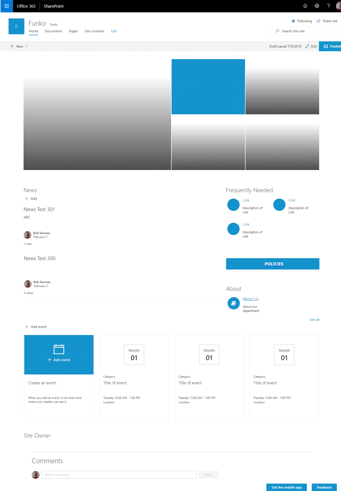

# SharePoint Swoop Reality Show Sample
## Triggers Flow to run an Azure function containing PnP PowerShell

## Summary

This sample shows how to build a site design and script for a simple department site, as created in the [SharePoint Swoop video](https://techcommunity.microsoft.com/t5/Microsoft-SharePoint-Blog/SharePoint-Swoop-the-intranet-makeover-show/ba-p/186892). A team of experts worked with [Funko Toys](https://www.funko.com/) to redesign their Intranet site in just three days. This site design was developed behind the scenes to provide a template for Funko's department sites.

This demo shows how to:

* Trigger a Microsoft Flow to call an Azure function to do things that aren't (yet?) supported by Site Designs; in this case, that includes placement of sections and web parts onto the home page, creation of an About page, and a customized view on the Site Pages library
* Create and include a Theme
* Deploy site designs and scripts using PowerShell to inject environment-specific values such as the tenant name, logo URL, etc.

## Sample

Solution|Author(s)
--------|---------
site-azure-function | Bob German, Microsoft

## Version history

Version|Date|Comments
-------|----|--------
1.0|July 10, 2018|Initial release

## Disclaimer
**THIS CODE IS PROVIDED *AS IS* WITHOUT WARRANTY OF ANY KIND, EITHER EXPRESS OR IMPLIED, INCLUDING ANY IMPLIED WARRANTIES OF FITNESS FOR A PARTICULAR PURPOSE, MERCHANTABILITY, OR NON-INFRINGEMENT.**

---

## Additional notes
To install this sample, you'll need to provision:

* a custom SharePoint Framework solution containing web parts
* an Azure function containing the PnP PowerShell to add these web parts to the site home page
* an Azure Queue to trigger the Azure Function when an item is added by a Flow
* a Microsoft Flow that's started by the Site Script and queues the request

Your needs may be simpler, and you may want to just refer to this to set up your scenario! Please take what you need and leave the rest.

Here are the details.

## Set up the SharePoint Framework solution

This solution uses the Hub Links List and Hub Box Button web parts from the [Links and Handlebars web parts](https://github.com/SharePoint/sp-dev-solutions/tree/master/solutions/LinksAndHandlebarsTemplate), which are placed on the home page. Follow the instructions in the readme to install them, and ensure that they're installed as "tenant scoped" so they can be used on all sites. The package is already set to allow this; just make sure that when you add the web parts to your app catalog you check the "Make this solution available to all sites in the organization" check box.

It's a good idea to test the web parts on a modern site before proceeding.

## Set up the Flow and Azure Function

A major requirement in the SharePoint Swoop project was to add web parts and sections to each department site in a consistent way. Since (at the time of this writing) this isn't supported by site designs and scripts, the solution is to use the PnP Provisioning Engine to perform those functions.

This solution is based on the documented process for [Calling the PnP Provisioning Engine from a site script](https://docs.microsoft.com/en-us/sharepoint/dev/declarative-customization/site-design-pnp-provisioning). Follow the steps in the article, adding information from this repo as follows:

* In the section, "Provision the SPFx solution", install the Links and Handlebars web parts instead of the ones in the article. (You may have already done that!)
* You can skip the section, "Create a PnP Provisioning template" as the template information is already in the Azure function in this repo
* In the section, "Finish the Azure Function", add the Azure Function code from this repo instead of the sample in the article. Make sure you set up the SPO_AppId and SPO_AppSecret application settings as explained in Step 4.
* You can skip the section "Create the Site Design" for now, as this is handled by the Install-SampleSiteDesign.ps1 PowerShell script in this repo

## Install the SharePoint Theme

This repo includes a PowerShell script,Install-SampleTheme.ps1, to create a custom site theme. You may want to make a new theme for your site, or you can stick with the Funko colors (which are close but not quite the same as the SharePoint colors). 

For example, if you want to call your theme DeptThemeSample, run this:

    .\Install-SampleTheme.ps1 `
      -Url https://<tenant>-admin.sharepoint.com `
      -ThemeName "DeptThemeSample"

## Install the Site Design and Site Script

The Install-SampleSiteDesign.ps1 script contains the site script JSON and the PowerShell to set it up. Notice that all tenant-specific settings are parameters to the script, and some of them are added to the site script at runtime.

For example, you might call

    .\Install-SampleSiteDesign.ps1 `
      -Url https://<tenant>-admin.sharepoint.com `
      -LogoUrl "https://www.somewhere.com/companyLogo.jpg" `
      -ThemeName "DeptThemeSample" `
      -FlowTriggerUrl "https://(URL from step 14 of the Site Design PnP Provisioning article)"

Now you should be able to create a Communications Site from SharePoint Home and the site design should be displayed. The site script triggers the Flow, which adds to the Azure Queue, which calls the Azure Function to populate the site home page.

