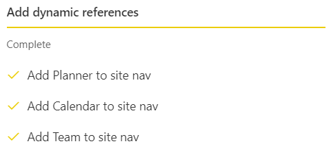
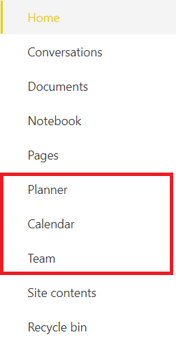

# Add dynamic references to default components of an Office 365 group

## Summary

By default, we already have in an Office 365 group links to the group’s document library, default notebook and mailbox. But how nice would it be to have links visible to users to the default Planner plan, Calendar and Team in the quick launch of an Office 365 group from the beginning? 

In this sample we are adding dynamic references to those default components of an Office 365 group by using the addNavLink script action combined with the _layouts/15/groupstatus.aspx?target=<target> URL.

Here is what the left navigation looks like after the script has been applied:

## Sample

Solution|Author(s)
--------|---------
site-config-add-dynamic-navlinks | Jarbas Horst

## Version history

Version|Date|Comments
-------|----|--------
1.0| November 18, 2019 |Initial release

## Disclaimer
**THIS CODE IS PROVIDED *AS IS* WITHOUT WARRANTY OF ANY KIND, EITHER EXPRESS OR IMPLIED, INCLUDING ANY IMPLIED WARRANTIES OF FITNESS FOR A PARTICULAR PURPOSE, MERCHANTABILITY, OR NON-INFRINGEMENT.**

---

## Additional notes

In this [blog post](https://blog.yannickreekmans.be/generic-urls-for-all-office-365-group-connected-workloads/) Yannick Reekmans explains how to use the _layouts/15/groupstatus.aspx?target=<target> URL in order to create generic URLs for all the Office 365 group connected components.