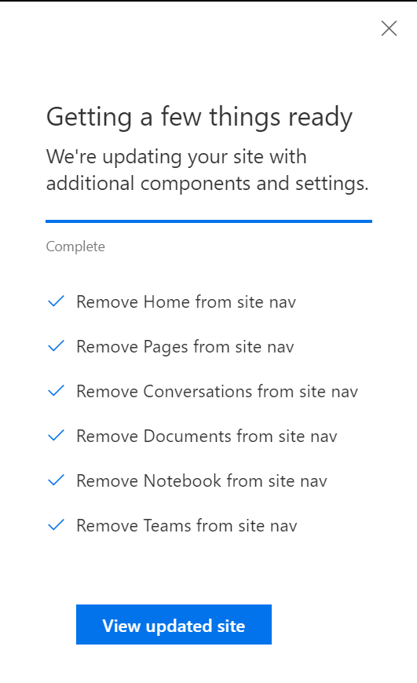

# Remove links from the site navigation list

## Summary

You can use the removeNavLink script action to remove links from the site navigation list. This can be especially useful for removing links that are added by default with the collaboration and communication templates.

In this sample we are removing all of the default links added by the default collaboration (team) template: home, pages, conversations, documents, notebook, site contents.

## Sample

Solution|Author(s)
--------|---------
site-config-remove-navlinks | Sean Squires

## Version history

Version|Date|Comments
-------|----|--------
1.0| August 7, 2018 |Initial release

## Disclaimer
**THIS CODE IS PROVIDED *AS IS* WITHOUT WARRANTY OF ANY KIND, EITHER EXPRESS OR IMPLIED, INCLUDING ANY IMPLIED WARRANTIES OF FITNESS FOR A PARTICULAR PURPOSE, MERCHANTABILITY, OR NON-INFRINGEMENT.**

---

