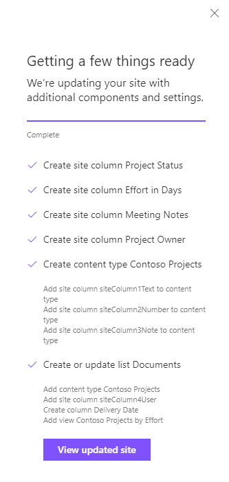

# Create Advanced Lists

## Summary

This sample illustrates several new advanced list actions and associated sub-actions:

* `createSiteColumn` - you can now define and add site columns. A site column is a reusable column definition, or template, that you can assign to multiple lists across multiple SharePoint sites. Supported subactions include designating the field type, display name, internal name, column grouping, and whether the field is required and must enforce unique values.

* `createContentType` - a content type is a reusable collection of metadata (columns) for a category of items or documents in a list or document library. Content types enable you to manage the settings for a category of information in a centralized, reusable way. When defining your content type you can its parent object, whether it is hidden, and what columns it contains. Note: this new action allows for the declaration of a new content type (the ability to reference an enterprise content type is still in development as of April 2018).

* `addSiteColumn` - use this action to add a site column to a declared content type.

* `addContentType` - use this action to add your defined content type to a list or library.

* `addSPView` - you can create custom views of libraries and lists to organize and show items that are most important to you (like certain columns) or to add filtering or sorting. Use this action to specify the desired columns and how you want the items displayed (using a CAML query). Subactions allow you to specify row limits, whether the view is paged, and recurses over items in nested folders or not. You can also designate your constructed view as the default.

This sample illustrates how to use a site script to modify the default library - adding a constructed content type, an additional site column, an additional list column, and defining a new default view. 

## Sample

Solution|Author(s)
--------|---------
advanced_list_configuration.json | SharePoint Team

## Version history

Version|Date|Comments
-------|----|--------
1.0|April 10, 2018|Initial release

## Disclaimer
**THIS CODE IS PROVIDED *AS IS* WITHOUT WARRANTY OF ANY KIND, EITHER EXPRESS OR IMPLIED, INCLUDING ANY IMPLIED WARRANTIES OF FITNESS FOR A PARTICULAR PURPOSE, MERCHANTABILITY, OR NON-INFRINGEMENT.**

---

