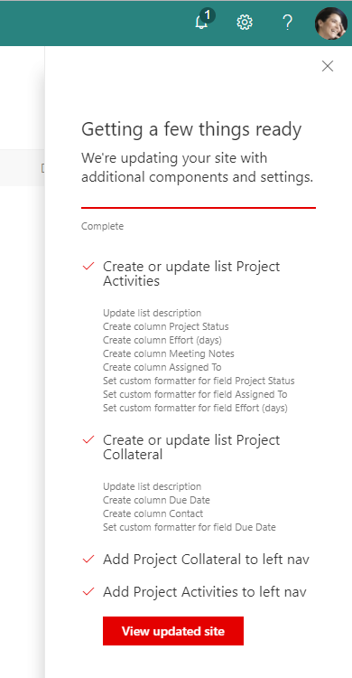

# Create formatted lists

## Summary
You can use the createSPList action to also apply custom column formatting - by including the formatting JSON directly in the site script. For more details on column formatting check out the following article:  https://support.office.com/en-us/article/Column-formatting-1f927342-2bed-4745-b727-ff8b7ff96b22?ui=en-US&rs=en-US&ad=US

And the samples included in the sp-dev-column-formatting repo: https://github.com/SharePoint/sp-dev-column-formatting

This sample illustrates how to use a site script to create a list and library using the new column formatting feature. It illustrates the following formats:

- Project Status applies conditional formatting based on the value in the text field
- Assigned To applies an action button to the field
- Effort (days) applies a data bar formatting based on the value in the number field
- Due Date applies conditional formatting based on the date being past current date

The sample also uses the addNavLink action to add the newly created list and library to the site nav.

## Sample

Solution|Author(s)
--------|---------
site-create-formatted-lists | SharePoint Team

## Version history

Version|Date|Comments
-------|----|--------
1.0|December 14, 2017|Initial release

## Disclaimer
**THIS CODE IS PROVIDED *AS IS* WITHOUT WARRANTY OF ANY KIND, EITHER EXPRESS OR IMPLIED, INCLUDING ANY IMPLIED WARRANTIES OF FITNESS FOR A PARTICULAR PURPOSE, MERCHANTABILITY, OR NON-INFRINGEMENT.**

---

## Additional notes

This sample is covered in the main documentation aroud Site Designs and Site Scripts.

- [SharePoint site design and site script overview](https://docs.microsoft.com/en-us/sharepoint/dev/declarative-customization/site-design-overview)

