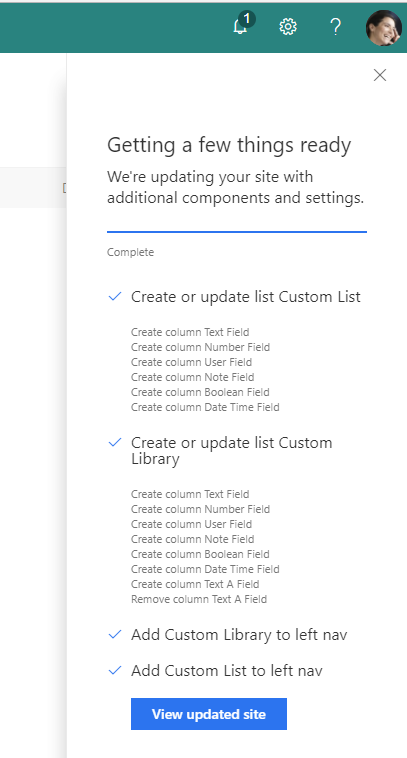

# Create lists with specific schema

## Summary
You can use the createSPList action to create lists and libraries with a specific schema - and even add them to the site nav. This sample illustrates how to use a site script to create a list and library and then add each of them to the site navigation. It illustrates all of the currently supported data types and also illustrates using the deleteSPField action that could be used for running updates. 

The sample also uses the addNavLink action to add the newly created list and library to the site nav.

## Sample

Solution|Author(s)
--------|---------
site-create-lists-add-to-site-nav | SharePoint Team

## Version history

Version|Date|Comments
-------|----|--------
1.0|December 14, 2017|Initial release

## Disclaimer
**THIS CODE IS PROVIDED *AS IS* WITHOUT WARRANTY OF ANY KIND, EITHER EXPRESS OR IMPLIED, INCLUDING ANY IMPLIED WARRANTIES OF FITNESS FOR A PARTICULAR PURPOSE, MERCHANTABILITY, OR NON-INFRINGEMENT.**

---

## Additional notes

This sample is covered in the main documentation aroud Site Designs and Site Scripts.

- [SharePoint site design and site script overview](https://docs.microsoft.com/en-us/sharepoint/dev/declarative-customization/site-design-overview)

