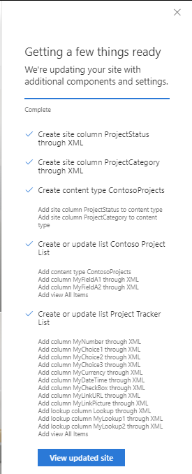
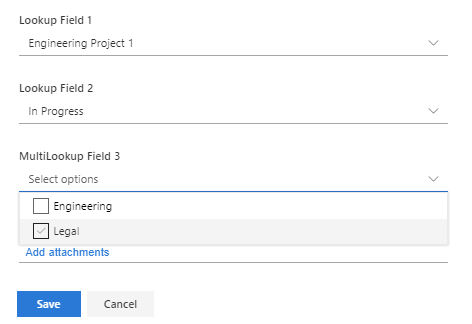

# Create lookup fields with field xml

## Summary

This sample illustrates using Field XML to create complex list fields - including lookup columns!

You can use the previously released addSPFieldXml script action to use Field element XML to define other internal data types and declare within a site script. If you wish to define your constructed field as a site column or add to a content type then use the new createSiteColumnXml script action. You can also use the addSPLookupFieldXml script action to create a lookup column to another declared list. For more info see https://msdn.microsoft.com/en-us/library/office/ms437580.aspx 

In this sample script we are:

1. creating two choice field site columns - "project status" and "project category"
2. adding these columns to a content type - "ContosoProjects"
3. adding the content type to a new project list - along with two text field list columns and overriding the default "all items" list view
4. creating a second "project tracker" list which illustrates Field XML examples for most data types - including three example lookup fields against the project list - looking up the title, project status and project category fields. The project category field is a multivalue lookup field.

Outcome in the list is as follows

## Sample

Solution|Author(s)
--------|---------
site-create-lookup-lists-spfieldxml | Sean Squires

## Version history

Version|Date|Comments
-------|----|--------
1.0| August 7, 2018 |Initial release

## Disclaimer
**THIS CODE IS PROVIDED *AS IS* WITHOUT WARRANTY OF ANY KIND, EITHER EXPRESS OR IMPLIED, INCLUDING ANY IMPLIED WARRANTIES OF FITNESS FOR A PARTICULAR PURPOSE, MERCHANTABILITY, OR NON-INFRINGEMENT.**

---

