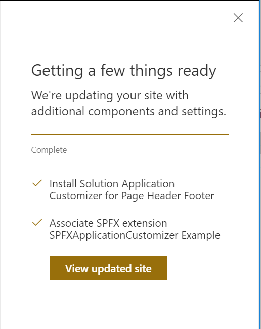

# Create lookup fields with field xml

## Summary

Use the associateExtension action to register a deployed SharePoint Framework extension from the tenant app catalog.

For more details on how to create and configure a SharePoint Framework extension, check out: [Overview of SharePoint Framework Extensions](https://docs.microsoft.com/en-us/sharepoint/dev/spfx/extensions/overview-extensions).

## Sample

Solution|Author(s)
--------|---------
site-register-spfx-extension | Sean Squires

## Version history

Version|Date|Comments
-------|----|--------
1.0| August 7, 2018 |Initial release

## Disclaimer
**THIS CODE IS PROVIDED *AS IS* WITHOUT WARRANTY OF ANY KIND, EITHER EXPRESS OR IMPLIED, INCLUDING ANY IMPLIED WARRANTIES OF FITNESS FOR A PARTICULAR PURPOSE, MERCHANTABILITY, OR NON-INFRINGEMENT.**

---

