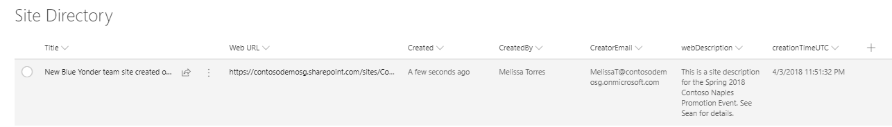

# Additional site information with triggerFlow action

## Summary

We have amended the `triggerFlow` site action to pass additional site information. These properties can be associated to variables in the JSON request body of a HTTP request Flow action and then used as dynamic content in other Flow actions like email and list objects.
These properties are automatically sent from the site provisioning engine. In other words: you don't have to explicitly write these properties in the sitescript-file. 

The properties that you can use are the following:
- webUrl
- creatorName
- creatorEmail
- webDescription
- createdTimeUTC

In this example you can use the included JSON in your HTTP Request action request body and then insert a new step like create SharePoint list item. First create the SharePoint list so you can reference it in the create item Flow action. Your list should include fields for each of the triggerFlow properties you'd like to capture. For this example you need to create a list to capture all sites created with this site design and script using a triggerFlow):

- Create a list with the following properties:
    - *Web Url* (maps to webUrl)
    - *CreatedBy* (maps to creatorName)
    - *CreatorEmail* (maps to creatorEmail)
    - *webDescription* (maps to webDescription)
    - *creationTimeUTC* (maps to createdTimeUTC)

- create a Flow that includes two steps:
    - When a HTTP Request is received (this action will use the include JSON for the request body. You can get the HTTP Post Url for your triggerFlow action after saving the flow)
    - Create item - SharePoint (this action will allow you to specify the list you created above. after you point it to the correct list you'll be able to map the list columns to the site properties as dynamic content.

After you save your Flow and update your triggerFlow action subsequent uses of this script will write back the site information as illustrated in the sample screenshot.

## Sample

Solution|Author(s)
--------|---------
request-body-json-schema.json | SharePoint Team

## Version history

Version|Date|Comments
-------|----|--------
1.0|April 10, 2018|Initial release

## Disclaimer
**THIS CODE IS PROVIDED *AS IS* WITHOUT WARRANTY OF ANY KIND, EITHER EXPRESS OR IMPLIED, INCLUDING ANY IMPLIED WARRANTIES OF FITNESS FOR A PARTICULAR PURPOSE, MERCHANTABILITY, OR NON-INFRINGEMENT.**

---

## Additional notes

This sample is covered in the main documentation on the Site Designs and Site Scripts.

- [SharePoint site design and site script overview](https://docs.microsoft.com/en-us/sharepoint/dev/declarative-customization/site-design-overview)

